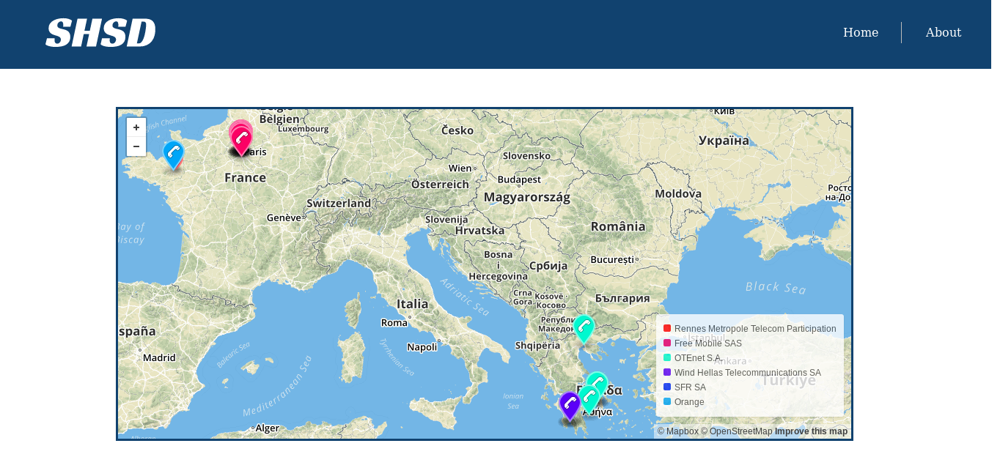

# SHSD - Self-Hosting Security Dashboard

There is no security without proper monitoring. SHSD aims to provide a synthetic overview of the security status of accounts and devices in a self-hosting context. It is tailored to users who can deploy self-hosting solutions (such as Yunohost or Sandstorm) or who have an account (mail address) on such hosting, without requiring expert security knowledge.

Progressively, it will present a couple of very simple indicators on account usage and local devices.

Some examples of what we aim to detect :

* An account compromised through the compromission of a low-security device such as a smartphone
* A local device infected with MIRAI

Some examples of what we explicitely **do not** aim to detect :

* APTs :-)

SHSD typically targets SOHO networks with less than 10 devices and less than 10 accounts.

# What is SHSD currently doing ?

On this very early stage, SHSD monitors usage of mail accounts to detect accounts compromission :

* It parses the dovecot-imap log in /var/logs/mail.log
* It stores the IPs from which each account has been authenticated
* For each IP, [Onyphe](https://www.onyphe.io) is used to retrieve the associated AS and geolocation (with variable precision)
* It renders the authentications geolocations on a map

It is aimed to be watched by the final users :

* Each user should use SHSD as its default homepage (rather than a typically blank page)
* Each user can see from where his account has been used
* If some points are in a strange area (a foreign country or an anormal ISP for instance), user should detect this unusual pattern and then ask the hoster/forums. It may mean that the account has been used by a third-party
* SHSD focus on the detection part, the remediation is out of our scope. We think that the global community on forums is quite efficient for remediation as soon as problems are detected.

 In a nutshell, SHSD tries to leverage users' unconscious reactions confronted with some change on a page which is usually quite static.

# Why ?

_Because self-hosting security matters._

Self-hosting is necessary to provide alternatives to GAFAMs. Security of self-hosting is a necessity for self-hosting to compete with GAFAMs. Security of self-hosting cannot be achieved in the same way as the security of GAFAMs but, on the other hand, self-hosters may have a better insight on what _should_ happen on their server.

Notably, exists :

* SIEM tools (prelude, ELK, etc.) exhibit security alerts but need dedicated human resources to provide any value ;
* Monitoring tools (Nagios, Grafana, etc.) show functional metrics (free memory, CPU usage) but security is mostly about non-functional activities (for which graphs are close to useless or need huge interpretation).

SHSD aims to provide value to self-hosters who are not security experts. To achieve this, SHSD leverages specific knowledge and insights a self-hoster may have about his own devices or the few hosted guest accounts.

SHSD does not feature any AI nor precog features.
